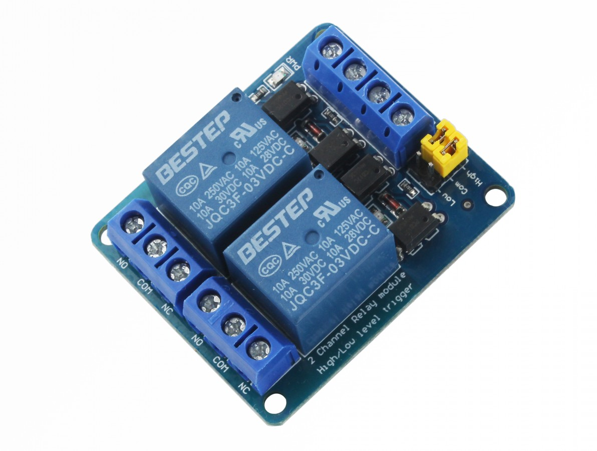
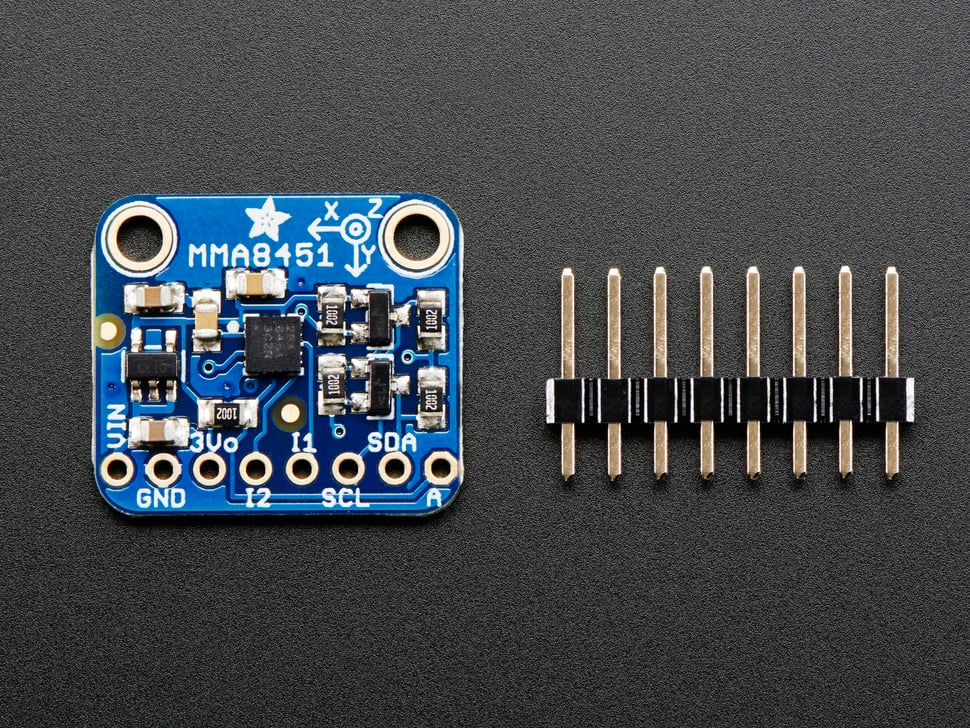

# Sistema Homem Morto Wireless  

Protótipo usando ESP32 e rede LoRaWan para monitorar os movimentos de um operador  

No grau de desenvolvimento atual o sistema foi utilizado em 
monitoramento de movimentos de um operador em uma sala de jateamento abrasivo cortando a pressão de ar em caso de acionamento do sistema.

## Hardware

WiFi LoRa 32 é uma placa de desenvolvimento IoT clássica, é um produto altamente integrado baseado em ESP32 + SX127x, possui Wi-Fi, BLE, funções LoRa, também sistema de gerenciamento de bateria Li-Po, OLED de 0,96″ também está incluído. É a melhor escolha para cidades inteligentes, fazendas inteligentes, casas inteligentes e fabricantes de IoT.

Módulos relé com optoacopladores para tenções de 3.3 V

Acelerômetro de 3 eixos 

## Desenvolvimento 

Prototipo foi desenvolvido utilizando a arduino IDE 1.8.19 que possui suporte para o desenvolvimento para ESP 32 
por meio do gerenciador de "placas".

## Pinout 

### Receptor 

 0  => Sinal da Porta 
 
 17 => Mudança de frequência
 
 32 => Saída Rele 1 
 
 33 => Saída Rele 2
 

### Transmissor 

13 => Botão DeepSleep

12 ou 0 => Led Bateria

17 => Led On

36 => Tensão da bateria

9 => SCL Acelerometro 

19 => SDA Acelerometro

